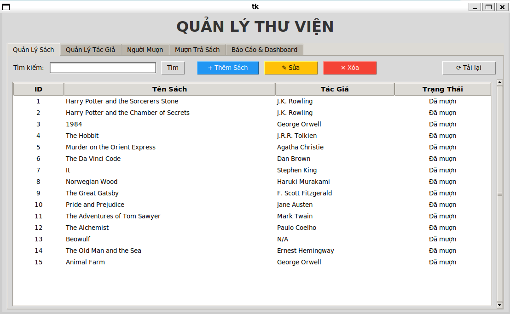
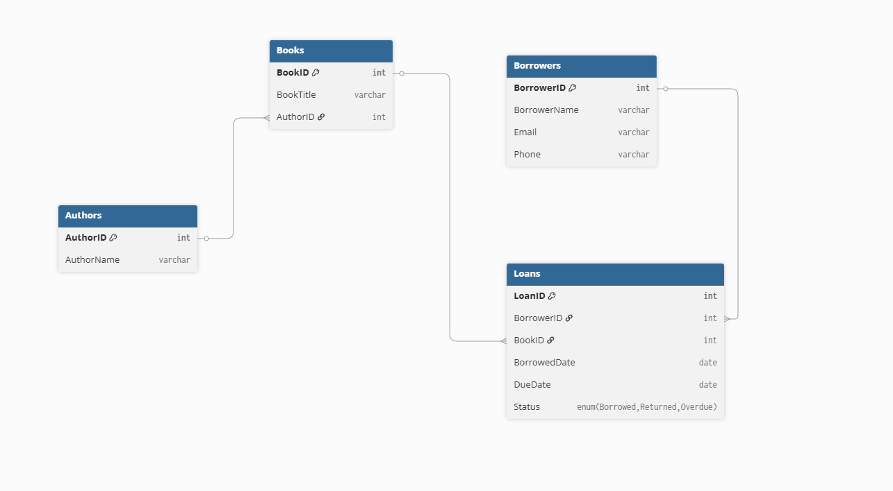
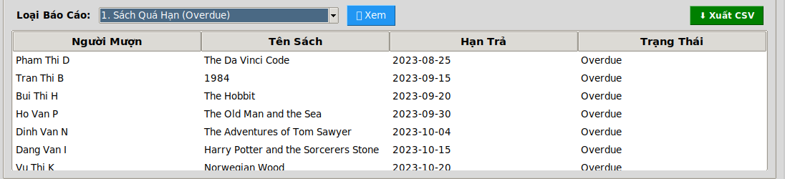
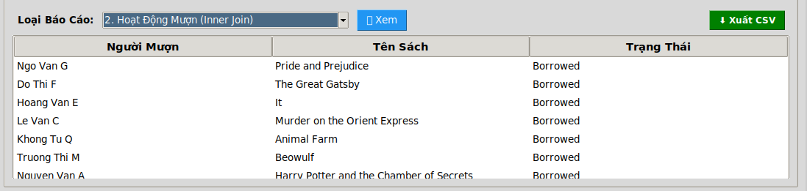
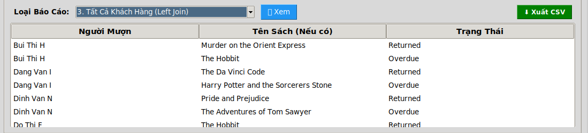
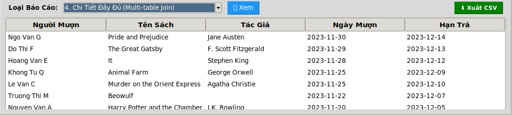

# Project 3: Library Information Manager (Hệ Thống Quản Lý Thư Viện)


## 📖 Tổng Quan (Overview)
**Library Information Manager** là một ứng dụng Desktop hoàn chỉnh phục vụ công tác quản lý thư viện. Dự án giải quyết vấn đề dư thừa dữ liệu và dị thường (anomalies) từ các bảng tính cũ (UNF) bằng cách thiết kế lại cơ sở dữ liệu đạt chuẩn **3NF (Third Normal Form)**.

Ứng dụng cung cấp giao diện đồ họa (GUI) thân thiện giúp thủ thư quản lý sách, tác giả, độc giả, thực hiện quy trình mượn/trả sách chặt chẽ và theo dõi hiệu quả hoạt động qua Dashboard trực quan.

### 🎥 Demo Video
Xem video demo chi tiết các chức năng và luồng hoạt động của ứng dụng tại đây:  
👉 [**LINK YOUTUBE DEMO (UNLISTED)**](https://youtube.com/...)

---

## 👥 Thành Viên Nhóm

| STT | Họ và Tên | MSSV | Vai Trò & Đóng Góp |
|:--:|:---|:---|:---|
| 1 | **[Tên Bạn A]** | [MSSV] | **Team Leader**: Thiết kế Database, Logic Backend (Models), Code Review. |
| 2 | **[Tên Bạn B]** | [MSSV] | **Frontend Dev**: Xây dựng GUI (Tkinter), Xử lý biểu đồ (Matplotlib), Export CSV. |
| 3 | **[Tên Bạn C]** | [MSSV] | **Tester & Doc**: Tạo dữ liệu mẫu (Seed), Testing, Viết báo cáo & Slides. |

---

## 🛠 Công Nghệ Sử Dụng (Tech Stack)

*   **Ngôn ngữ:** Python 3.x
*   **Giao diện (GUI):** Tkinter (Standard Library), `tkinter.ttk` (Theme hiện đại).
*   **Cơ sở dữ liệu:** MySQL Server (Relational Database).
*   **Thư viện Python:**
    *   `mysql-connector-python`: Driver kết nối MySQL.
    *   `python-dotenv`: Quản lý biến môi trường, bảo mật thông tin kết nối.
    *   `matplotlib`: Vẽ biểu đồ thống kê Dashboard.
    *   `pandas` (Tùy chọn): Hỗ trợ xuất dữ liệu ra CSV/Excel.

---

## ✨ Tính Năng Chính (Key Features)

### 1. 📊 Dashboard & Báo Cáo Thông Minh
*   **KPIs Real-time:** Cập nhật tức thời Tổng số sách, Số độc giả, Số lượt đang mượn và Số sách quá hạn.
*   **Biểu đồ trực quan:** Biểu đồ tròn (Pie Chart) thể hiện tỉ lệ trạng thái Mượn/Trả/Quá hạn.
*   **Hệ thống báo cáo:**
    *   Báo cáo sách quá hạn (Overdue Books).
    *   Lịch sử hoạt động mượn trả (Sử dụng kỹ thuật JOIN nhiều bảng).
*   **Xuất dữ liệu:** Tính năng **Export to CSV** giúp lưu trữ báo cáo để in ấn hoặc xử lý thêm trên Excel.

### 2. 📚 Quản Lý Sách & Tác Giả (Master Data)
*   **Chuẩn hóa dữ liệu:** Tách biệt bảng **Authors** và **Books** để loại bỏ dư thừa dữ liệu.
*   **CRUD Sách:** Thêm, Sửa, Xóa sách với Validation (kiểm tra dữ liệu đầu vào).
*   **Tìm kiếm:** Hỗ trợ tìm kiếm sách theo Tên sách hoặc Tên tác giả.
*   **Quản lý Tác giả:** Thêm/Sửa/Xóa tác giả độc lập.

### 3. 🔄 Quy Trình Mượn & Trả (Circulation)
*   **Mượn sách (Borrow):**
    *   Chỉ cho phép mượn những cuốn sách đang có sẵn (Available).
    *   Tự động tính ngày hết hạn (Due Date).
*   **Trả sách (Return):**
    *   Cập nhật trạng thái sách về "Available".
    *   Ghi nhận hoàn tất giao dịch.
*   **Quy tắc nghiệp vụ:** Ngăn chặn việc xóa độc giả hoặc sách đang nằm trong giao dịch mượn chưa trả.

---

## 🚀 Hướng Dẫn Cài Đặt & Chạy (Installation)

Vui lòng làm theo các bước sau để thiết lập môi trường phát triển:

### Bước 1: Clone Repository
```bash
git clone https://github.com/username/library-manager.git
cd library-manager
```
### Bước 2: Virtual Environment
Khuyên dùng môi trường ảo để tránh xung đột thư viện: 
```bash 
# Windows
python -m venv venv
venv\Scripts\activate

# macOS/Linux
python3 -m venv venv
source venv/bin/activate
```

### Bước 3: Cài đặt thư viện 
```bash 
pip install -r requirements.txt
```

### Bước 4: Khởi tạo cơ sở dữ liệu 
```bash 
mysql -u root -p library_db < app/db/schema.sql
mysql -u root -p library_db < app/db/seed.sql
```

### Bước 5: Cấu hình biến môi trường (.env)

```bash 
DB_HOST=localhost
DB_PORT=3306
DB_USER=root
DB_PASSWORD=YOUR_PASSWORD_HERE
DB_NAME=library_db
```

### Bước 6: Chạy ứng dụng

```bash 
python app/main.py
```

### Cấu trúc thư mục 
library-manager/
├── app/
│   ├── db/
│   │   ├── schema.sql         # Script tạo bảng và ràng buộc (DDL)
│   │   ├── seed.sql           # Script chèn dữ liệu mẫu (DML)
│   │   └── connection.py      # Module xử lý kết nối MySQL
│   ├── models/                # Lớp xử lý logic dữ liệu (DAO Pattern)
│   │   ├── book_model.py
│   │   ├── author_model.py
│   │   ├── borrower_model.py
│   │   ├── loan_model.py
│   │   └── report_model.py
│   └── main.py                # Entry point & Giao diện chính (GUI)
├── docs/                      # Tài liệu dự án
│   ├── report/                # File báo cáo PDF
│   └── screenshots/           # Ảnh chụp màn hình
├── .env.example               # Mẫu cấu hình môi trường
├── .gitignore                 # Bỏ qua các file không cần thiết
├── requirements.txt           # Danh sách thư viện cần thiết
└── README.md                  # Tài liệu hướng dẫn này

### Ảnh chụp màn hình 

1. Dashboard Thống Kê & KPI

2. Giao Diện Quản Lý Sách (Tìm kiếm & Grid View)

3. Sơ Đồ Cơ Sở Dữ Liệu (ERD - 3NF)

4. SAMPLE_QUERY 





### Giải Thích Thiết Kế Database (3NF) 
Dữ liệu ban đầu (UNF) chứa các cột lặp lại và phụ thuộc không hoàn toàn. Nhóm đã chuẩn hóa về dạng 3NF như sau:
Authors (1NF -> 2NF): Tách AuthorName ra khỏi bảng Books để tránh lặp lại và xóa sự phụ thuộc bắc cầu (BookID -> AuthorName).
Books (3NF): Chỉ chứa thông tin về sách và tham chiếu AuthorID (Foreign Key).
Borrowers (3NF): Lưu trữ thông tin độc giả nguyên tố, tách biệt với thông tin mượn sách.
Loans (3NF): Bảng trung gian giải quyết quan hệ N-N giữa Người và Sách, lưu trữ trạng thái giao dịch (BorrowedDate, DueDate, Status).

### ⚖️ License & Acknowledgements
Dự án này là bài tập cuối kỳ môn Cơ Sở Dữ Liệu.
Giảng viên hướng dẫn: Trần Đức Minh. 


